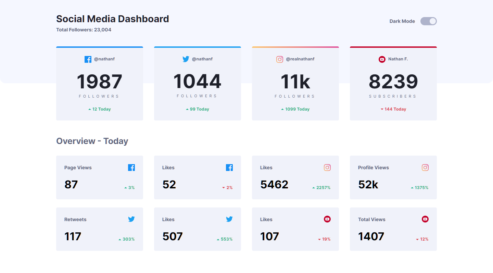
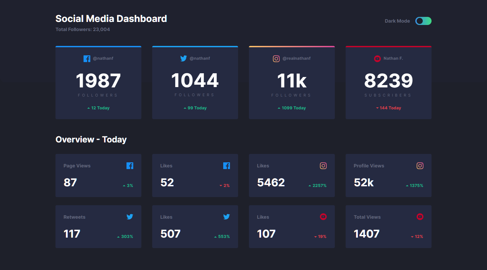

# Frontend Mentor - Social media dashboard with theme switcher solution

This is a solution to the [Social media dashboard with theme switcher challenge on Frontend Mentor](https://www.frontendmentor.io/challenges/social-media-dashboard-with-theme-switcher-6oY8ozp_H). Frontend Mentor challenges help you improve your coding skills by building realistic projects. 

## Table of contents

- [Overview](#overview)
  - [The challenge](#the-challenge)
  - [Screenshot](#screenshot)
  - [Links](#links)
- [My process](#my-process)
  - [Built with](#built-with)
  - [What I learned](#what-i-learned)
  - [Continued development](#continued-development)
  - [Useful resources](#useful-resources)
- [Author](#author)

## Overview

### The challenge

Users should be able to:

- View the optimal layout for the site depending on their device's screen size
- See hover states for all interactive elements on the page
- Toggle color theme to their preference

### Screenshot




### Links

- HTML Solution URL: [HTML](https://github.com/JustANipple/social-media-dashboard-with-theme-switcher/blob/main/index.html)
- CSS Solution URL: [CSS](https://github.com/JustANipple/social-media-dashboard-with-theme-switcher/blob/main/styles/css/main.css)
- JavaScript dark-mode Solution URL: [JS dark mode](https://github.com/JustANipple/social-media-dashboard-with-theme-switcher/blob/main/scripts/script.js)
- JavaScript follower cards Solution URL: [JS follower cards](https://github.com/JustANipple/social-media-dashboard-with-theme-switcher/blob/main/scripts/followers-script.js)
- JavaScript overview cards Solution URL: [JS overview cards](https://github.com/JustANipple/social-media-dashboard-with-theme-switcher/blob/main/scripts/followers-script.js)
- Live Site URL: [LIVE](https://justanipple.github.io/social-media-dashboard-with-theme-switcher/)

## My process

### Built with

- Semantic HTML5 markup
- CSS custom properties
- Flexbox
- CSS Grid
- Mobile-first workflow
- JavaScript
- JavaScript components

### What I learned

Cards that repeat made me thinking of components, so instead of repeating lines of HTML, i decided to write a script that creates a component as many times as needed, just by filling an array that contains variables of that block.
I made a script for the followers and overview parts, so that it can be reusable and/or filled with more informations too

This is the first time I implemented a dark mode and i wanted to have a nice challenge, so i managed to make it work with SASS too and i think i made a nice solution

Followers card component:
```js
    const inner = 
    `
    <div class="top_wrapper">
        
        <p class="nickname">${card.user}</p>
    </div>
    <div class="mid_wrapper">
        <p class="total_number">${card.totalNum}</p>
        <p class="par">${card.type}</p>
    </div>
    <div class="bottom_wrapper">
        
        <p class="difference ${card.status}"> <span class="number">${card.todayNum}</span> Today</p>
    </div>
    `;
```

### Continued development

I'm getting used to components. they are a great way to make the code cleaner and faster to write. Learning a framework might be the next step

### Useful resources

- [Dark mode](https://javascript.plainenglish.io/how-to-create-a-dark-mode-with-sass-scss-and-vanilla-javascript-e1c7835cf474) - If you want to implement a dark mode using SCSS, this might be a nice resource to get started

## Author

- Frontend Mentor - [@JustANipple](https://www.frontendmentor.io/profile/JustANipple)
